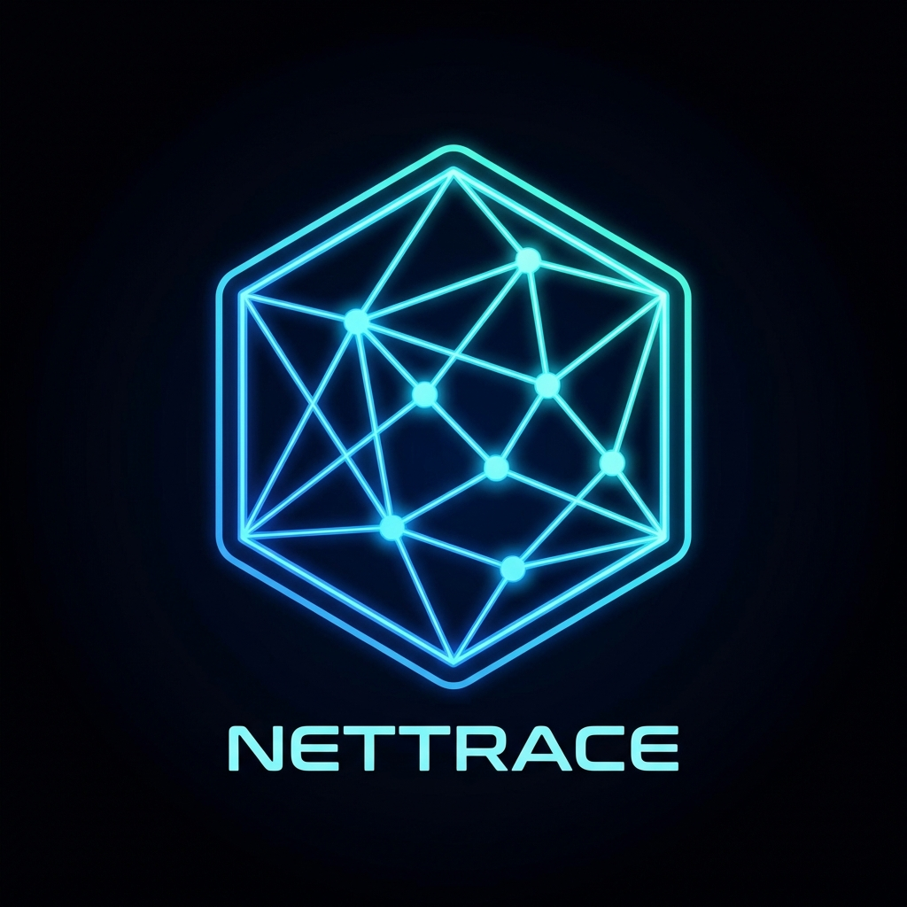

# 🌍 NetTrace: Live Network Traceroute Dashboard



**NetTrace** is a real-time network monitoring dashboard that visualizes your active connections on an interactive 2D map or 3D globe. It automatically detects established connections, traces their path (traceroute), and geolocates every hop to give you a stunning visual representation of your network traffic.

## ✨ Key Features

*   **Real-Time Monitoring**: Automatically detects active connections (TCP/UDP) on your machine.
*   **Live Visualization**:
    *   **2D Map**: Classic flat map view using Leaflet.js.
    *   **3D Globe**: Cyberpunk-style interactive globe using `globe.gl`.
*   **Detailed Analytics**:
    *   **Live Latency**: Real-time ping monitoring with sparkline graphs.
    *   **Hop-by-Hop Tracing**: See the exact path packets take to their destination.
    *   **Organization & ASN**: Identifies ISPs and organizations (e.g., "Google LLC", "Akamai").
    *   **Protocol Detection**: Auto-detects HTTP, HTTPS, SSH, DNS, etc.
*   **Persistence**:
    *   **SQLite Database**: Saves connection history and latency data locally.
    *   **Data Retention**: "Clear History" feature to wipe old data.
*   **UI/UX**:
    *   **Dark Mode**: Sleek, glassmorphism-inspired design.
    *   **Country Flags**: Visual indicators for connection destinations.
    *   **Duration Timers**: Tracks how long connections have been active.

## 🚀 Getting Started

### Prerequisites

*   **Python 3.9+** (Admin/Root privileges required for ICMP traceroute)
*   **Git**

### Installation

1.  **Clone the repository**:
    ```bash
    git clone https://github.com/soitgoes511/TracerouteLiveMap.git
    cd TracerouteLiveMap
    ```

2.  **Install dependencies**:
    ```bash
    pip install -r requirements.txt
    ```

### Running Natively (Recommended for Windows)

For the best experience on Windows (to capture all host traffic), run the application natively with Administrator privileges.

1.  Open a terminal as **Administrator**.
2.  Run the application:
    ```bash
    python app.py
    ```
3.  Open your browser and navigate to: `http://localhost:5000`

### Running with Docker / Podman

You can also run NetTrace in a container.

**Note for Windows Users**: Docker/Podman on Windows (WSL2) runs inside a VM. Using `--net=host` will only start showing traffic *from inside that Linux VM*, not your Windows host traffic. For full host visibility, use the Native method above.

1.  **Build the image**:
    ```bash
    podman build -t nettrace .
    ```

2.  **Run the container**:
    ```bash
    podman run --rm -it --net=host --cap-add=NET_ADMIN -v $(pwd)/nettrace.db:/app/nettrace.db nettrace
    ```

## 🛠️ usage

*   **Dashboard**: The sidebar lists all active connections. Click on any item to fly to it on the map.
*   **Switch Views**: Use the toggle in the top-right to switch between **2D Map** and **3D Globe**.
*   **Clear History**: Click the trash icon in the sidebar header to wipe the database.

## 🏗️ Architecture

*   **Backend**: Python (Flask, Flask-SocketIO)
*   **Network Utils**: `psutil` (scanning), `icmplib` (traceroute/ping)
*   **Database**: SQLite (local persistence)
*   **Frontend**: HTML5, CSS3, JavaScript
*   **Libraries**: Leaflet.js, Globe.gl, Chart.js

## 📝 License

MIT License
